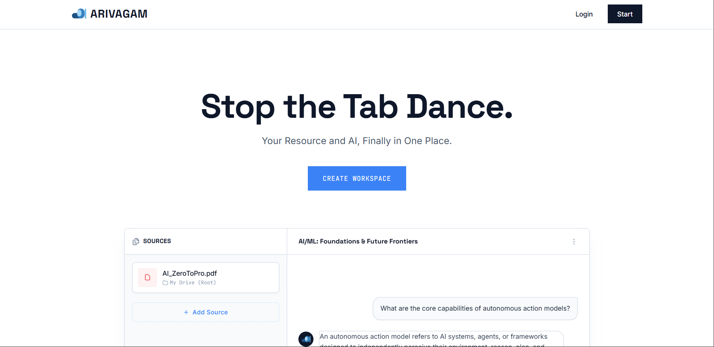
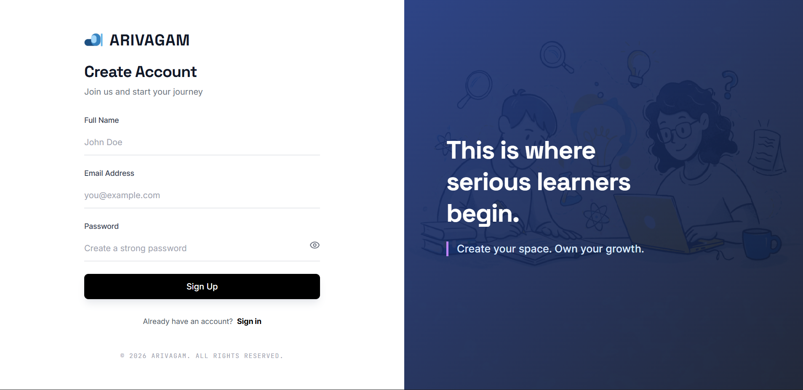
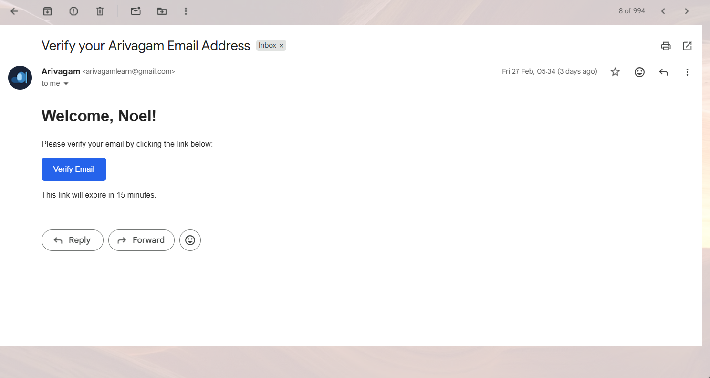
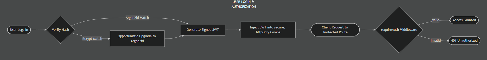
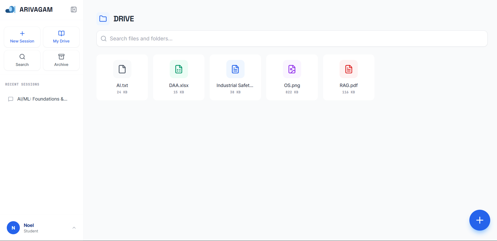
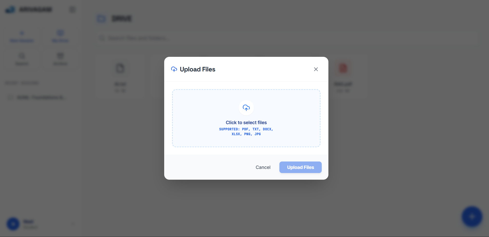
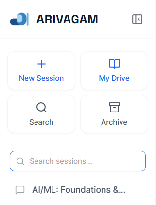
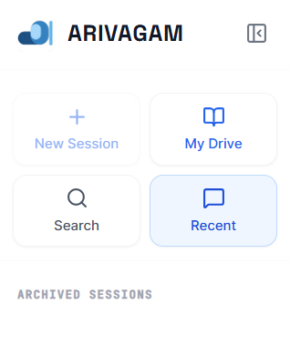
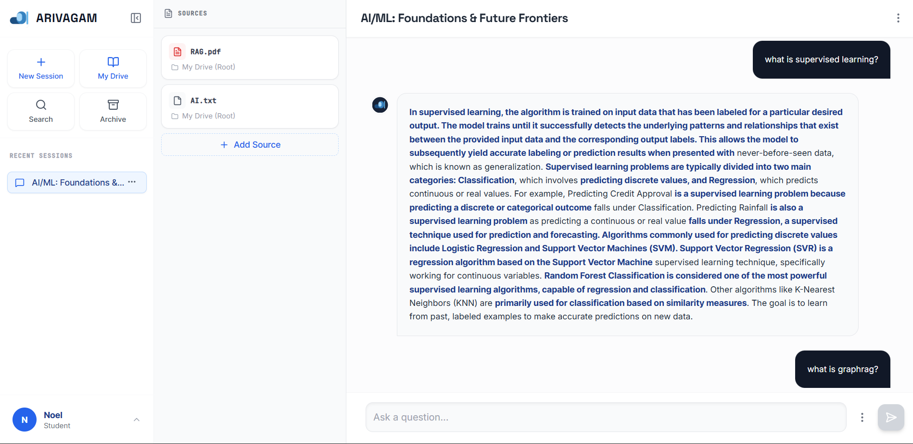

<h1 align="center">
  
</h1>

## 🚀 The Hook: Zero-Hallucination Architecture

**Arivagam** is not just another "AI PDF Chatbot." It is a rigorously engineered, **Deterministic RAG (Retrieval-Augmented Generation) Engine** explicitly built for unified workspace experience for students and researchers to store their resource and compute at the same place. 

We completely abandon stochastic LLM JSON-formatting and fragile prompt-engineering for generating citations due to the limitation in free tier tokens. Instead, Arivagam utilizes a custom, server-side **N-gram diffing algorithm** to mathematically guarantee that any highlighted UI text is an exact, **verbatim extraction** from the user's uploaded documents. If the underlying LLM attempts to drift or paraphrase source text inappropriately, the Verbatim Engine catches it—ensuring an absolute, zero-hallucination guarantee for every provided citation.


> **[🖼️ VISUAL WALKTHROUGH: HERO / LANDING PAGE]**

<p align="center">
  
</p>


## 🛠 Tech Stack & Environment

Based on a rigorous analysis of the application architecture, Arivagam utilizes the following stack:

### Frontend
- **Framework:** React 19 (Vite)
- **Styling & UI:** Tailwind CSS, Framer Motion, Lucide React
- **Authentication:** Custom JWT with Secure HTTP-Only Cookies
- **Routing & Networking:** React Router v7, Axios
- **Markdown Parsing:** React Markdown

### Backend
- **Core:** Node.js, Express.js (v5)
- **Databases:** MongoDB (Mongoose) for relational state, **Pinecone** for Vector Embeddings
- **AI & LLMs:** Google Generative AI (Gemini)
- **Blob Storage:** Cloudinary 
- **Document Processing:** PDF-Extraction, Mammoth (DOCX), Tesseract.js (OCR), XLSX
- **Security & Mail:** JWT, bcryptjs, argon2, Google APIs (Gmail OAuth2)

### `.env.example`

```env
# ==========================================
# SERVER ENDPOINT CONFIGURATION (server/.env)
# ==========================================
PORT=5000
MONGODB_URI=mongodb://localhost:27017/arivagam_local_dev

# Vector Store
PINECONE_API_KEY=your_pinecone_api_key
PINECONE_INDEX_NAME=arivagam-index

# LLM APIs
GEMINI_API_KEY=your_google_gemini_api_key

# Blob Storage (Cloudinary)
CLOUDINARY_CLOUD_NAME=your_cloud_name
CLOUDINARY_API_KEY=your_cloud_api_key
CLOUDINARY_API_SECRET=your_cloud_api_secret

# Security
JWT_SECRET=super_secure_random_string_for_signing_tokens

# Mail Services (Google OAuth2)
EMAIL_USERNAME=your_gmail@address.com
OAUTH_CLIENT_ID=your_oauth_client_id
OAUTH_CLIENT_SECRET=your_oauth_client_secret
OAUTH_REFRESH_TOKEN=your_oauth_refresh_token

# ==========================================
# CLIENT ENDPOINT CONFIGURATION (client/.env)
# ==========================================
VITE_API_URL=http://localhost:5000/api
```

## 🔐 Custom Authentication Architecture

Arivagam utilizes a fully independent, custom **JWT (JSON Web Token)** authentication system built entirely from scratch to ensure total data sovereignty and granular control over the security pipeline.

> **[🖼️ VISUAL WALKTHROUGH: REGISTRATION & AUTHENTICATION]**

<p align="center">
  
  
</p>

### Authentication Flow Blueprint

<p align="center">
  
</p>

<p align="center">
  
</p>

## 🗺 System Architecture Blueprint

<p align="center">
  
</p>

<p align="center">
  
</p>

> **[🖼️ VISUAL WALKTHROUGH: DASHBOARD / UPLOAD FLOW]**

<p align="center">
  
  
</p>

> **[🖼️ VISUAL WALKTHROUGH: ARCHIVE & SEARCH]**

<p align="center">
  
  
</p>


### Security & Reliability Profile:
1. **Stateless JWT Login:** Upon verified login, the server generates a JWT signed with a private `JWT_SECRET`.
2. **Strict HTTP-Only Cookies:** *Crucially*, the JWT is never sent to the client's Javascript scope. It is injected directly into a `secure`, `sameSite: 'none'`, `httpOnly` cookie. This strictly mathematically mitigates **XSS (Cross-Site Scripting)** attacks because malicious client-side JS simply cannot read the token.
3. **Opportunistic Password Hashing:** By owning the Auth layer, we gained the exact control needed to implement a seamless migration path for dynamic security standards. If a legacy user logs in with an old `bcrypt` hash, the system authenticates them and automatically upgrades their database record to the modern `argon2id` standard in the background without interrupting the user experience.


## ⚙️ Engineering Achievements

- **Universal Multi-Format Parser:** A robust ingestion pipeline utilizing varying strategies (`pdf-extraction` for PDFs, `tesseract.js` for image OCR, `mammoth` for DOCX, and `xlsx` for spreadsheets). All documents are unified into clean UTF-8 text buffers entirely in RAM before routing.
- **Asynchronous Pipeline & Optimistic UI:** The server aggressively releases the client thread immediately after parsing the file buffer (`202 Accepted`). Expensive operations (embedding, remote blob storage, summary generation) run headlessly via `Promise.allSettled`, providing a fast, non-blocking UI experience on the frontend (powered by Framer Motion).
- **N-Gram Verbatim Extractor:** Eliminated the industry-standard reliance on LLMs to generate citation text. Using an in-memory N-Gram diffing (`textMatcher`) pass over the RAG context guarantees that the highlighted fragments (`<u>` tags) rendered in the Typewriter UI are mathematically present in the source material, providing 100% resistance to citation hallucinations.
- **Automated Distributed Rollback:** Dealing with 3 parallel third-party APIs (MongoDB, Cloudinary, Pinecone) inherently creates distributed transaction risks. Our failsafe logic guarantees that if *any* single service throttles (e.g., Pinecone rate limits), the `FileController` automatically triggers cleanup: wiping orphaned Cloudinary blobs, cleaning stale Pinecone vectors, and dropping pending DB states to prevent storage leaks.
- **Dynamic Context Injection:** Chat sessions enforce isolation by filtering Pinecone Vector queries strictly against the active session's document IDs (`$in: session.sourceFiles`). The retrieved fragments are dynamically deduplicated before feeding the GEMINI LLM to optimize token consumption.
- **Opportunistic Password Hashing:** A seamless migration path for dynamic security standards. If a user logs in with a legacy `bcrypt` hash, the system authenticates them and automatically upgrades their database record to the modern `argon2id` standard in the background without interrupting the user experience.
- **Dynamic API Rate Limit Recovery:** What happens when an LLM API hard-limits during a demo? The Hybrid Logic Engine calculates exactly when heavily-throttled free-tier APIs (like Gemini) will reset relative to the server's local timezone (IST), reporting an exact "Try again in X hours Y mins" metric to the end user instead of crashing with a generic `500 Internal Server Error`.

> **[🖼️ VISUAL WALKTHROUGH: CHAT VIEW & HIGHLIGHTED CITATIONS]**

<p align="center">
  
</p>

## 💻 Local Setup

Run the following commands to instantly boot the environment. Ensure you have populated the `.env` files in both directories according to the `.env.example` above.

```bash
# Clone the repository
git clone https://github.com/your-username/arivagam.git
cd arivagam

# Setup and run the Server (Terminal 1)
cd server
npm install
npm run dev

# Setup and run the Client (Terminal 2)
cd client
npm install
npm run dev
```

The application will be accessible at `http://localhost:5173`.

## ⚖️ Architecture Constraints & Target Expansions

Arivagam is currently engineered as a prototype running on a **100% Free-Tier CI/CD** infrastructure constraint (Vercel, Render Free, MongoDB Free, Cloudinary Free, Gemini 2.5 Flash Free Tier). Because of the physical execution constraints imposed by these free models, the backend involves calculated trade-offs that would dynamically adjust with a production upgrade.

1. **Document Ingestion Volume vs. AI Quotas**
   * *Current Trade-off:* Free-tier AI datasets implement strict reverse chronological processing buffers that limit prompt parsing to approximately 25,000 tokens prior to vector generation. Exceeding this triggers automated `429 Too Many Requests` API blockages during batch insertions.
   * *The Expansion:* Shifting to an enterprise API tier (e.g., Google Cloud Vertex AI) lifts batching limits, unlocking true, asynchronous background parsing of multi-hundred-page research dossiers entirely removed from client throttling logic.

2. **Temporary RAM Storage (The `multer` Bottleneck)**
   * *Current Trade-off:* Uploaded documents are buffered entirely within the Node.js V8 heap memory (`multer.memoryStorage`) during the stream to Cloudinary to bypass the ephemeral, stateless nature of Render's free storage disks.
   * *The Expansion:* While this is the fastest immediate execution loop, it introduces Out-of-Memory (OOM) crashing risks under heavy concurrent loads (Node's 512MB free tier cap). The production evolution involves an S3 Direct-Upload bucket utilizing Presigned URLs directly from the React client, cutting out the backend memory bottleneck entirely.

3. **Rate Limit Throttling Metrics**
   * *Current Trade-off:* Upon triggering maximum Requests-Per-Minute API blockages, the Hybrid Logic Engine catches the `429` crash, performs localized timezone calculations, and returns an exact "Retry In" temporal metric to the client instead of a generic `500 Server Error`.
   * *The Expansion:* A Pay-As-You-Go API token removes the need for this complex recovery logic entirely, shifting system limits from artificial quota boundaries to pure vector search concurrency boundaries.

## 🚀 Roadmap: Further Implementation & System Augmentations

The current iteration of Arivagam serves as the foundational architecture for an advanced academic operating framework. The following components are targeted for future development to expand ingestion capabilities, improve ingestion speeds, and significantly enhance user engagement metrics.

1. **Enhanced Document Processing:** Elevating the ingestion engine via `pdf2json` or Python-based computer vision microservices (OCR) to parse highly complex academic tables and multi-column academic research PDFs reliably.
2. **Platform Agnostic Access:** Integrating the Meta/Twilio WhatsApp Business API to facilitate headless vector-database querying from mobile devices without requiring desktop frontend authentication.
3. **Upload Acceleration:** Re-architecting the buffer flow away from server-side Node.js RAM (`multer.memoryStorage`) toward Direct-to-Storage Presigned URLs (S3/Cloudinary) to alleviate backend OOM risks and minimize client wait times.
4. **Live Web Browsing & References:** Integrating Puppeteer or Cheerio via LLM Function Calling, enabling the engine to fetch and vectorize live external URLs as supplementary context when uploaded documents lack sufficient answers.
5. **Interactive Knowledge Assessment:** Introducing a UI module engineered to dynamically generate multiple-choice and short-answer quizzes strictly grounded in the vectorized document index.
6. **Chain of Thought (CoT) UI:** Exposing the LLM’s internal reasoning structure, allowing users to visually trace exactly *how* the AI formulated an answer prior to final synthesis.
7. **Persistent Chat Context Memory:** Shifting from isolated single-query RAG interactions to stateful database architecture, storing conversation histories in MongoDB and passing rolling recent-turns into the LLM context window for multi-turn conversational follow-ups.
8. **Dynamic Notion-Style Dashboard:** Migrating from a static split-pane layout to a modular workspace environment featuring drag-and-drop file organization, custom tagging, and pin-able citation saving.
9. **Mobile-Optimized Viewport:** Developing a responsive, secondary frontend framework tailored for immediate query resolution on mobile screens, functioning as a companion to the deep-research desktop interface.